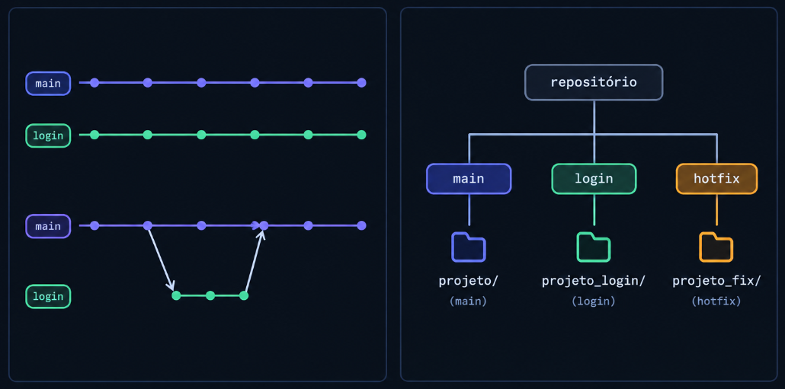

## Sem Worktree

Se estou na `main` e quero trabalhar na branch com a feature de login:

- Ao trocar para `login`, todo o meu diretório passa a estar nessa branch.
- Se for necessária uma alteração urgente na `main`, tenho que:
  1. Dar um `stash` nas alterações atuais ou fazer um commit na branch em que estou.
  2. Trocar para a `main`.
  3. Fazer a correção.
  4. Fazer o commit.
  5. Voltar para a branch `login`.
  6. Recuperar o que estava fazendo.

Preciso ficar **trocando o estado do mesmo diretório** entre as branches.

## Com Worktree

Posso ter:

```text
projeto/        → main
projeto_login/  → login
projeto_fix/    → hotfix
```

Todas ao mesmo tempo.

Cada branch fica em um diretório e está sempre aberta. Para trabalhar em uma delas, basta trocar de diretório.

## "Mas qual o motivo para fazer isso e não só trocar de branch?"

Estou fazendo uma grande feature e atualmente tenho:

* código incompleto;
* arquivos modificados;
* alguns arquivos até quebrados;
* não é possível compilar nada ainda.

Nesse momento, apareceu um bug urgente na `main`.

Sem Worktree, eu precisaria guardar o estado atual (`stash` ou commit), trocar de branch, fazer a correção e depois voltar para o que estava fazendo.

Com Worktree, é só trocar de diretório:

```text
projeto_login/  → continuo trabalhando na feature
projeto_fix/    → faço a correção do bug
```

Sem precisar de `stash`, commit ou clone de arquivos manualmente.

## Branch x Worktree 
> O que cada coisa responde?

**Branch** → Qual linha de desenvolvimento estou usando?

**Worktree** → Onde, fisicamente, essa linha de desenvolvimento está aberta?

Podemos pensar da seguinte forma:

```text
                 Repositório
                /     |      \
               /      |       \
            main     login    hotfix
             ↓         ↓         ↓
          diretório  diretório  diretório
```

Uma branch representa uma **linha de desenvolvimento**, enquanto um worktree representa o **diretório físico onde essa linha está sendo trabalhada**.

---

## Visualização do fluxo


