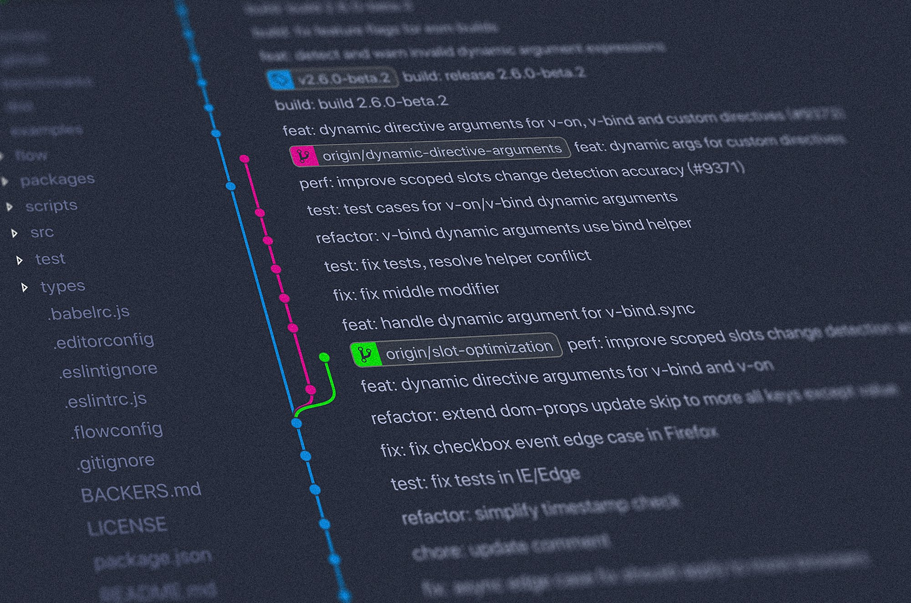

# Git Worktree



O **Git Worktree** permite trabalhar com múltiplas branches do mesmo repositório simultaneamente, cada uma em um diretório diferente.

Isso é útil, por exemplo, para manter uma branch de desenvolvimento aberta enquanto trabalha em outra branch sem precisar ficar fazendo `git checkout`/`git switch` constantemente.

## Comandos

```bash
git worktree add        # adiciona um novo worktree ao repositório
git worktree remove     # remove um worktree
git worktree prune      # remove informações de worktrees que não existem mais no sistema de arquivos
git worktree lock       # bloqueia um worktree para impedir que ele seja removido ou podado automaticamente
git worktree unlock     # remove o bloqueio de um worktree
git worktree list       # lista todos os worktrees associados ao repositório.
git worktree move       # move um worktree para outro diretório.
git worktree repair     # corrige referências de worktrees quando os caminhos registrados pelo Git ficaram inconsistentes.
```

### Add uso:
```bash
git worktree add <path> <branch>
```
#### Parâmetros do `add`
`<path>` - diretório onde o novo worktree será criado.
```bash
git worktree add ../feature-login feature/login
```
`<branch>` - branch que será utilizada no novo worktree.
```bash
git worktree add ../feature-login feature/login
```
`-b <new-branch>` - cria uma nova branch e já adiciona o worktree utilizando essa branch.
```bash
git worktree add -b feature/login ../feature-login
```
`-B <new-branch>` - cria ou redefine a branch informada e adiciona o worktree.
```bash
git worktree add -B feature/login ../feature-login
```
`--detach` - cria o worktree sem associá-lo a uma branch.
```bash
git worktree add --detach ../teste
```
`--force` - permite criar um worktree mesmo quando o Git normalmente impediria a operação, como em algumas situações em que a branch já está associada a outro worktree.
```bash
git worktree add --force ../feature-login feature/login
```

---

### Remove uso:
```bash
git worktree remove <worktree>
```
Exemplo:
```bash
git worktree remove ../feature-login
```
#### Parâmetros do `remove`
`--force` - força a remoção do worktree, inclusive quando existem alterações não commitadas.
```bash
git worktree remove --force ../feature-login
```
> A remoção do worktree não remove a branch associada a ele.

---

### Prune uso:

```bash
git worktree prune
```
Por exemplo, se um diretório de worktree foi apagado manualmente:
```bash
rm -rf ../feature-login
```
O Git ainda pode manter informações sobre esse worktree. O `prune` limpa essas referências.
#### Parâmetros do `prune`
`-n` / `--dry-run` - mostra o que seria removido sem executar a remoção.
```bash
git worktree prune --dry-run
```
`-v` / `--verbose` - exibe informações adicionais durante a limpeza.
```bash
git worktree prune --verbose
```

---

### Lock uso:
```bash
git worktree lock <worktree>
```
#### Parâmetros do `lock`
`--reason <string>` - adiciona uma justificativa para o bloqueio.
```bash
git worktree lock --reason "Worktree utilizado para desenvolvimento" ../feature-login
```
O motivo pode ser visualizado posteriormente com:
```bash
git worktree list
```

---

### Unlock uso:
```bash
git worktree unlock <worktree>
```
Exemplo:
```bash
git worktree unlock ../feature-login
```

---

### List uso:
```bash
git worktree list
```
Exemplo de saída:
```text
/home/dev/projeto       abc1234 [main]
/home/dev/projeto-dev   def5678 [dev]
/home/dev/projeto-fix   987abcd [feature/fix]
```
#### Parâmetros do `list`
`--porcelain` - exibe as informações em um formato mais detalhado e estruturado.
```bash
git worktree list --porcelain
```
`-v` / `--verbose` - exibe informações adicionais.
```bash
git worktree list --verbose
```

---

### Move uso:
```bash
git worktree move <worktree> <new-path>
```
Exemplo:
```bash
git worktree move ../feature-login ../login
```
Isso altera o caminho registrado pelo Git sem precisar remover e recriar o worktree.

---

### Repair uso:
```bash
git worktree repair
```
Também pode ser utilizado informando caminhos específicos:
```bash
git worktree repair <path>
```
É especialmente útil depois de mover manualmente um diretório ou alterar a localização do repositório principal.

---

### Exemplo de uso completo

existe um projeto:

```text
projeto/
```
E você esteja trabalhando na branch `main`.

Para criar um worktree para a branch `dev`:
```bash
git worktree add ../projeto-dev dev
```

A estrutura ficará:
```text
projeto/
└── ...

projeto-dev/
└── ...
```

Agora é possível trabalhar simultaneamente:
```text
projeto/       → main
projeto-dev/   → dev
```

Cada diretório possui seu próprio estado de trabalho, mas ambos utilizam o mesmo repositório Git.

Para visualizar:
```bash
git worktree list
```

Para remover quando terminar:
```bash
git worktree remove ../projeto-dev
```

---

### Fluxo básico

```bash
# Criar worktree
git worktree add ../projeto-dev dev

# Listar worktrees
git worktree list

# Trabalhar normalmente
cd ../projeto-dev

# Voltar ao projeto principal
cd ../projeto

# Remover o worktree
git worktree remove ../projeto-dev

# Limpar referências antigas, se necessário
git worktree prune
```

<!-- link pra explicação prática -->